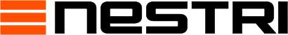

    <a href="https://nestri.io">
        <picture>
            <source srcset="packages/www/public/" />
        </picture>
    </a>

  <a href="https://nestri.io">
    <picture>
      <source srcset="packages/web/public/logo.white.svg" media="(prefers-color-scheme: dark)">
      <source srcset="packages/web/public/logo.black.svg" media="(prefers-color-scheme: light)">
      
    </picture>
  </a>

Deploy and stream games/apps in the cloud. Use our GPUs or bring your own.

  
  
  
 <!--   -->

<!-- TODO: Add a link to the demo app when it's ready -->
<!-- TODO: Add a link to install for self-hosters -->
<!-- TODO: Add a CTA for hosted option -->
<!-- TODO: Add feature imagery like Lobechat -->
