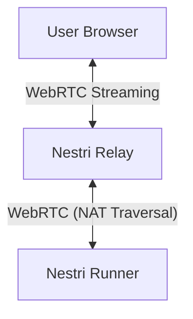

<div align="center">
<h1>

<a href="https://nestri.io" >

</a>

</h1>
</div>

&nbsp;
&nbsp;

**Welcome to Nestri**, a cutting-edge cloud gaming web streaming platform that lets you play high-performance games directly from your browser — no downloads or installations required! 🚀</strong>
<br/>
<br/>

</div>

<div align="center">

[![][github-release-shield]][github-release-link]
[![][discord-shield]][discord-link]
[![][github-license-shield]][github-license-link]
[![][github-stars-shield]][github-stars-link]

**Share the Nestri Repository on Social Media**

[![][share-x-shield]][share-x-link]
[![][share-reddit-shield]][share-reddit-link]

</div>
&nbsp;
&nbsp;

## 📌 Features
- 🎮 **Play Instantly**: Stream games on any device with a Chromium-based browser.  
- ☁ **Cloud-Powered**: Use our fully hosted service without any self-hosting hassle.  
- 🧰 **BYOG (Bring Your Own GPU)**: Utilize our infrastructure while running your own GPU server — whether it's under your desk or in a homelab rack.  
- 🛠 **Self-Host**: Optionally, host the entire stack yourself.  
- ⚡ **Low Latency**: Optimized for high-speed performance.  
- 🎥 **HD Streaming**: Supports up to 1080p resolution.  
- 🕹 **Controller Support**: ➞ *Planned soon*  
- 📱 **Native App**: ➞ *Planned later*  
- 📺 **TV App**: ➞ *In discussion*  
- 🎉 **Share with Friends & Family**: Easily share your gaming rig with others.  

## 📦 Installation & Setup  
### 🔧 Prerequisites for BYOG  
Ensure you have the following installed:  
- A Linux distribution (e.g. Debian, Ubuntu, Fedora or Arch)  
- [Docker](https://www.docker.com/get-started) or [Podman](https://podman.io/get-started)  
- A compatible NVIDIA, Intel, or AMD GPU  
- [NVIDIA Container Toolkit](https://docs.nvidia.com/datacenter/cloud-native/container-toolkit/latest/install-guide.html) *(NVIDIA GPUs only)*  

### 🚀 Quick Start  
➞ *Coming soon*  

## 🏗 Architecture Overview


## 🛠 Documentation
To build and run the documentation:
```sh
cd apps/docs/
bun install
bun run nestri.dev
```
You can also view the latest documentation on [docs.nestri.io](https://docs.nestri.io)

## 🤝 Contributing
We welcome contributions! Fork the repository and submit a pull request.  
If you find a bug or have an idea or any problems with the documentation, feel free to create an [issue](https://github.com/nestrilabs/nestri/issues).

## 💵 Sponsoring
We'd be incredibly grateful for any support — whether it's a contribution, donation, sharing our project, or simply cheering us on. Every bit helps us move closer to our goal of an open-source cloud gaming platform!  

We greatly appreciate sponsorship via [Polar](https://polar.sh/nestri) 🧡

## 📜 License
This project is licensed under the AGPL-3.0 license. See the [LICENSE](https://github.com/nestrilabs/nestri?tab=AGPL-3.0-1-ov-file#readme) file for details.

## 🌐 Links & Resources
- [Official Website](https://nestri.io)
- [Documentation](https://github.com/nestrilabs/nestri/tree/main/apps/docs)
- [Discord Community](https://discord.com/invite/Y6etn3qKZ3)
- [Polar](https://polar.sh/nestri)

**Happy Gaming! 🎮🔥**


[github-release-link]: https://github.com/nestriness/nestri/releases
[github-release-shield]: https://img.shields.io/github/v/release/nestriness/nestri?color=369eff&labelColor=black&logo=github&style=flat-square
[discord-shield]: https://img.shields.io/discord/1080111004698021909?color=5865F2&label=discord&labelColor=black&logo=discord&logoColor=white&style=flat-square
[discord-link]: https://discord.com/invite/Y6etn3qKZ3
[github-license-shield]: https://img.shields.io/github/license/nestriness/nestri?color=white&labelColor=black&style=flat-square
[github-license-link]: https://github.com/nestriness/nestri/blob/main/LICENSE
[github-stars-shield]: https://img.shields.io/github/stars/nestriness/nestri?color=ffcb47&labelColor=black&style=flat-square
[github-stars-link]: https://github.com/nestriness/nestri/network/stargazers
[share-x-shield]: https://img.shields.io/badge/-share%20on%20x-black?labelColor=black&logo=x&logoColor=white&style=flat-square
[share-x-link]: https://twitter.com/intent/tweet?text=Hey%2C%20check%20out%20this%20Github%20repository.%20It%20is%20an%20open-source%20self-hosted%20Geforce%20Now%20alternative.&url=https%3A%2F%2Fgithub.com%2Fnestriness%2Fnestri
[share-reddit-shield]: https://img.shields.io/badge/-share%20on%20reddit-black?labelColor=black&logo=reddit&logoColor=white&style=flat-square
[share-reddit-link]: https://www.reddit.com/submit?title=Hey%2C%20check%20out%20this%20Github%20repository.%20It%20is%20an%20open-source%20self-hosted%20Geforce%20Now%20alternative.&url=https%3A%2F%2Fgithub.com%2Fnestriness%2Fnestri
[image-overview]: assets/banner.png
[website-link]: https://nestri.io
[neko-url]: https://github.com/m1k1o/neko
[image-star]: assets/star-us.png
[moq-github-url]: https://quic.video
[vmaf-cuda-link]: https://developer.nvidia.com/blog/calculating-video-quality-using-nvidia-gpus-and-vmaf-cuda/
